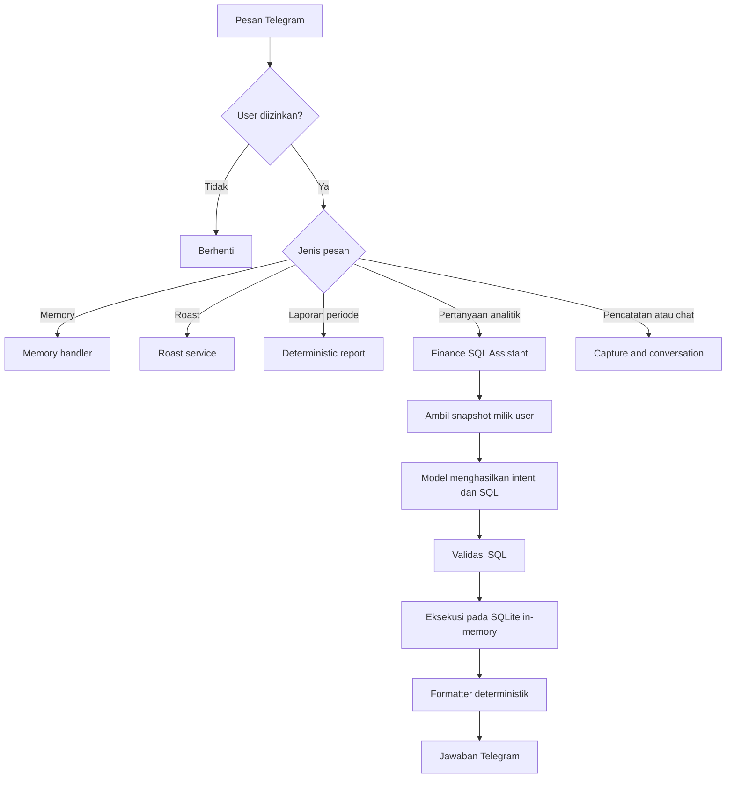
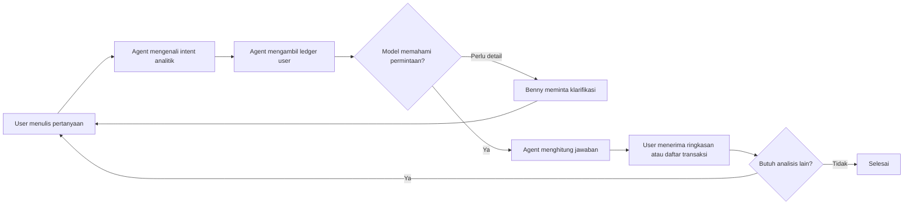
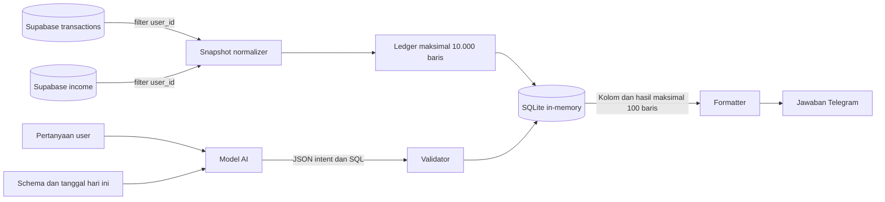
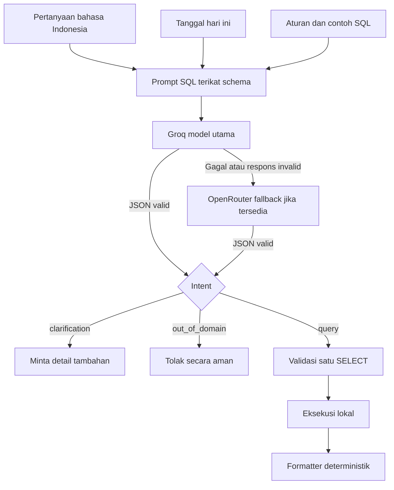

# Finance SQL Assistant

## Deskripsi

Finance SQL Assistant adalah fitur analitik read-only yang memungkinkan pengguna bertanya tentang pemasukan dan pengeluaran melalui Telegram menggunakan bahasa sehari-hari. Pengguna tidak perlu menulis SQL.

Alurnya terdiri dari dua proses yang berbeda:

1. Model AI menerjemahkan pertanyaan bahasa manusia menjadi satu query SQL `SELECT`.
2. Aplikasi menjalankan query pada snapshot SQLite sementara, lalu formatter deterministik menerjemahkan hasil query menjadi jawaban bahasa Indonesia.

Model tidak menerjemahkan hasil SQL menjadi jawaban akhir dan tidak menerima isi ledger. Model hanya menerima pertanyaan, tanggal hari ini, schema tabel virtual, aturan keamanan, dan contoh query. Pemisahan ini membuat perhitungan tetap berasal dari database, bukan angka yang dibuat oleh model.

## Fungsi dan batas fitur

Fitur ini mendukung analisis read-only:

- total dan jumlah transaksi;
- pemasukan versus pengeluaran;
- kategori atau item dengan pengeluaran terbesar;
- top-N transaksi;
- minimum, maksimum, dan rata-rata;
- pengelompokan berdasarkan kategori, tanggal, minggu, atau bulan;
- rentang waktu seperti hari ini, minggu ini, bulan ini, dan N hari terakhir.

Fungsi utamanya adalah:

- mengubah pertanyaan keuangan berbahasa natural menjadi SQL;
- mengambil snapshot ledger yang hanya dimiliki user aktif;
- menghitung agregasi dan pencarian detail secara lokal;
- mengubah hasil query menjadi jawaban Indonesia dengan format Rupiah;
- menolak permintaan tulis dan query yang berada di luar batas aman.

Fitur ini tidak melakukan perubahan data, eksplorasi schema, forecasting, rekomendasi pengeluaran, budget, goals, dashboard, PDF, atau general-purpose chat.

## Struktur implementasi

| File | Tanggung jawab |
| --- | --- |
| `services/telegram/bot.py` | Menempatkan SQL Assistant setelah laporan deterministik dan sebelum capture transaksi. |
| `services/reporting/service.py` | Menangani laporan pengeluaran dengan periode yang deterministik. |
| `services/reporting/sql_assistant.py` | Routing analitik, validasi SQL, eksekusi SQLite, dan formatter jawaban. |
| `services/ai/service.py` | Meminta Groq, lalu fallback OpenRouter bila tersedia, membuat JSON intent dan SQL read-only. |
| `services/infrastructure/database.py` | Mengambil snapshot `transactions` dan `income` berdasarkan `user_id`. |
| `tests/test_finance_sql_assistant.py` | Regression test untuk routing, SQL safety, isolasi user, agregasi, dan formatter. |

Secara logis, implementasinya terbagi menjadi lima lapisan:

| Lapisan | Komponen | Peran |
| --- | --- | --- |
| Antarmuka | Telegram | Menerima pertanyaan dan menampilkan hasil. |
| Routing | `TelegramService` dan `FinanceSqlAssistant.try_handle()` | Membedakan laporan, analitik, pencatatan, dan permintaan write. |
| Retrieval | `SupabaseService.get_finance_snapshot()` | Membaca data user dari `transactions` dan `income`. |
| AI | `AIService.generate_finance_sql()` | Menghasilkan intent dan satu query SQLite read-only. |
| Eksekusi dan presentasi | Validator, SQLite `:memory:`, dan formatter | Memvalidasi SQL, menghitung hasil, lalu menyusun jawaban. |

## Data contract snapshot

Data production dinormalisasi ke satu tabel virtual bernama `ledger`:

| Kolom | Sumber `transactions` | Sumber `income` | Keterangan |
| --- | --- | --- | --- |
| `kind` | `expense` | `income` | Jenis ledger. |
| `date` | `date` | `date` | Format ISO `YYYY-MM-DD`. |
| `time` | `time` | `time` | Waktu transaksi. |
| `name` | `item_name` | `source` | Nama barang atau sumber pemasukan. |
| `category` | `category` | `category` | Kategori ledger. |
| `amount` | `amount` | `amount` | Integer IDR positif. |
| `notes` | `notes` | `notes` | Catatan transaksi bila tersedia. |
| `location` | `location` | string kosong | Lokasi pengeluaran bila tersedia. |

`user_id`, chat history, memory, dan kolom internal tidak dimasukkan ke snapshot. Ownership sudah diterapkan sebelum data meninggalkan Supabase.

## Flowchart end-to-end



## User flow



Pengguna cukup menyebut objek analisis, metrik, dan periode bila diperlukan. Contoh: `total pengeluaran bulan ini`, `lima transaksi terbesar`, atau `kapan aku bayar ChatGPT`. Jika periode atau metrik benar-benar ambigu, agent meminta satu klarifikasi singkat dan tidak menebak.

## Data flow dan retrieval



Retrieval dilakukan oleh `SupabaseService.get_finance_snapshot(user_id)`:

1. Query `transactions` mengambil `date`, `time`, `item_name`, `category`, `amount`, `notes`, dan `location` dengan filter `user_id`.
2. Query `income` mengambil `date`, `time`, `source`, `category`, `amount`, dan `notes` dengan filter `user_id`.
3. Kedua hasil dinormalisasi menjadi kontrak `ledger` yang sama.
4. Baris digabung, diurutkan dari tanggal dan waktu terbaru, lalu dibatasi maksimal 10.000 baris.
5. Snapshot dimuat ke SQLite `:memory:` hanya selama request berjalan dan koneksi ditutup setelah query selesai.

Tidak ada pencarian semantik, embedding, atau vector database. Retrieval di sini adalah pembacaan terfilter berdasarkan ownership user, lalu analisis relasional menggunakan SQL.

## AI flow dan cara model bekerja



Model bekerja sebagai penerjemah intent dan query, bukan sebagai kalkulator keuangan:

1. Prompt mendefinisikan schema virtual `ledger`, tanggal hari ini, istilah informal Indonesia, batas query, dan contoh SQL.
2. Model utama memakai provider Groq dengan `temperature=0`. Jika request gagal atau respons tidak valid, aplikasi dapat mencoba model OpenRouter yang sudah dikonfigurasi.
3. Model wajib mengembalikan JSON berisi `intent`, `sql`, dan `clarification`.
4. Model memilih `query`, `clarification`, atau `out_of_domain`.
5. Untuk intent `query`, SQL tetap dianggap tidak tepercaya dan harus lolos validator serta SQLite authorizer.
6. SQLite menghitung hasil dari data nyata. Formatter aplikasi menentukan judul, label, Rupiah, detail transaksi, dan pemecahan pesan tanpa meminta model kedua.

Model tidak menerima raw ledger rows, `user_id`, chat history, memory, Supabase key, atau connection string. Karena itu model tidak dapat membaca database secara langsung atau membuat jawaban berdasarkan data yang tidak dikirim kepadanya.

## Workflow runtime

1. Telegram menerima pesan teks dari user yang diizinkan.
2. `TelegramService` memproses explicit-memory command terlebih dahulu.
3. `ExpenseReportService` mencoba laporan deterministik seperti `laporan kemarin` atau `total pengeluaran bulan ini`.
4. `FinanceSqlAssistant` memeriksa kata domain finansial dan kata analitik.
5. `SupabaseService.get_finance_snapshot()` membaca `transactions` dan `income` dengan filter `user_id`.
6. Snapshot dinormalisasi, digabung, diurutkan berdasarkan tanggal/waktu terbaru, lalu dibatasi maksimal 10.000 baris.
7. Model utama Groq menerima pertanyaan, tanggal hari ini, dan schema virtual `ledger`; fallback OpenRouter dapat dipakai bila tersedia. Provider tidak menerima Supabase key, connection string, atau raw rows.
8. Respons model harus berupa JSON dengan intent `query`, `clarification`, atau `out_of_domain`.
9. Query `SELECT` divalidasi, dijalankan pada SQLite `:memory:`, dan hasil dibatasi maksimal 100 baris.
10. Formatter memilih structured response type dari intent dan bentuk hasil. Renderer menampilkan jawaban utama lebih dulu tanpa mengulang pertanyaan atau proses SQL. Rincian transaksi menampilkan nama, nominal, waktu, serta note dan lokasi bila tersedia.
11. Hasil panjang dikirim dalam beberapa pesan agar tidak terpotong oleh batas Telegram.

## Use case

| No. | Kebutuhan | Contoh pertanyaan | Bentuk analisis |
| --- | --- | --- | --- |
| 1 | Mengukur kebiasaan transaksi | `Pengeluaran apa yang paling sering?` | Hitung frekuensi per nama serta total nominalnya. |
| 2 | Melihat transaksi terbesar | `5 transaksi paling besar apa saja?` | Daftar detail terurut dengan `LIMIT 5`. |
| 3 | Menemukan kategori paling boros | `Kategori paling boros apa?` | `GROUP BY category`, urut total terbesar. |
| 4 | Membandingkan arus uang | `Bandingkan total pemasukan dan pengeluaran` | Agregasi berdasarkan `kind`. |
| 5 | Menghitung rata-rata | `Rata-rata pengeluaran berapa?` | `AVG` untuk seluruh snapshot pengeluaran. |
| 6 | Mencari transaksi berdasarkan nominal | `Aku beli apa saja antara 10 sampai 60 ribu?` | Filter `amount BETWEEN` dan daftar detail. |
| 7 | Menemukan waktu pembayaran tertentu | `Kapan aku subscribe ChatGPT?` | Pencarian nama case-insensitive dan urutan terbaru. |
| 8 | Menghitung biaya item tertentu | `Total pengeluaran untuk ChatGPT berapa?` | Pencarian nama dan `SUM` nominal. |

## Cara menggunakan

Kirim pertanyaan natural language seperti:

```text
Pengeluaran apa yang paling sering?
Kategori paling boros apa?
Bandingkan total pemasukan dan pengeluaran.
5 transaksi paling besar apa saja?
Rata-rata pengeluaran berapa?
Kapan aku subscribe ChatGPT?
```

Contoh jawaban:

```text
Pengeluaran Terbesar

Kategori: Makanan
Total pengeluaran: Rp750.000
```

Kalimat pencatatan seperti `beli kopi 25 ribu` tetap masuk capture dan confirmation flow. Kalimat `hapus semua transaksi` ditolak sebagai permintaan write.

## SQL generation contract

Provider AI hanya boleh menghasilkan JSON berikut:

```json
{
  "intent": "query",
  "sql": "SELECT ... FROM ledger ...",
  "clarification": ""
}
```

Prompt SQL menetapkan tanggal hari ini sebagai literal agar periode tidak bergantung pada clock SQLite. Contoh query yang diharapkan:

```sql
SELECT category, SUM(amount) AS total_pengeluaran
FROM ledger
WHERE kind = 'expense'
  AND date BETWEEN '2026-08-01' AND '2026-08-14'
GROUP BY category
ORDER BY total_pengeluaran DESC
LIMIT 1
```

## Guardrail

### Boundary routing

- User harus lolos private-user check.
- Laporan deterministik diprioritaskan sebelum SQL Assistant.
- Pernyataan transaksi tidak boleh salah dianggap sebagai query analitik.
- Permintaan write finansial ditolak sebelum akses database.

### Boundary data

- Semua query Supabase memakai `user_id` user aktif.
- Snapshot tidak disimpan ke disk dan tidak dikirim ke model.
- Snapshot hanya memuat delapan kolom virtual yang diperlukan untuk analisis.
- Batas snapshot adalah 10.000 transaksi terbaru per request.

### Boundary SQL

- Tepat satu statement.
- Hanya `SELECT` atau `WITH ... SELECT`.
- Hanya tabel `ledger` dan CTE yang merujuk ke `ledger`.
- Dilarang `INSERT`, `UPDATE`, `DELETE`, `DROP`, `ALTER`, `CREATE`, `ATTACH`, `DETACH`, `PRAGMA`, dan statement mutasi lain.
- Query detail wajib memiliki `LIMIT` 1–100.
- Fungsi SQLite dibatasi allowlist.
- SQLite authorizer menolak operasi read/write di luar tabel virtual.
- Progress handler menghentikan query yang berjalan terlalu lama.

### Boundary output

- Maksimal 100 baris hasil.
- Jawaban dipotong pada batas Telegram sekitar 4.000 karakter.
- Nominal integer diformat sebagai Rupiah.
- Kategori umum diterjemahkan ke label Indonesia.
- Response type dipilih secara deterministik dari intent dan bentuk kolom hasil.
- Jawaban utama ditampilkan sebelum konteks dan detail.
- Pertanyaan user serta detail proses SQL tidak diulang pada respons normal.
- Output tidak memakai emotikon.
- Hasil kosong dibedakan dari kegagalan database, kegagalan provider, dan query tidak aman.

## Error behavior

| Kondisi | Respons user |
| --- | --- |
| Snapshot kosong | Tidak ada data transaksi yang dapat dianalisis. |
| Supabase gagal | Data keuangan belum dapat diambil dari database. |
| Pertanyaan ambigu | Benny meminta satu klarifikasi singkat. |
| Provider Groq gagal | Layanan analitik sementara tidak tersedia. |
| SQL tidak aman | Query analitik tidak aman atau tidak dapat dijalankan. |
| Permintaan di luar domain | Benny hanya menjawab analisis read-only keuangan pribadi. |

## Configuration and verification

Fitur memakai konfigurasi AI yang sudah ada:

- `GROQ_API_KEY`
- `GROQ_MODEL`
- `OPENROUTER_API_KEY` dan `OPENROUTER_MODEL` untuk fallback bila dikonfigurasi
- `AI_TIMEOUT_SECONDS`
- `AI_MAX_RETRIES`
- `SUPABASE_URL`
- `SUPABASE_SERVICE_ROLE_KEY` untuk backend server-only

Verifikasi lokal:

```powershell
.\venv\Scripts\python.exe -m unittest discover -s tests -p 'test_*.py'
.\venv\Scripts\python.exe -m compileall -q config services main.py tests
```

Smoke test production harus read-only: gunakan pertanyaan analitik, cek jawaban Telegram, dan pastikan jumlah baris `transactions` serta `income` tidak berubah.

## Known ceiling

Snapshot saat ini mengambil maksimal 10.000 transaksi terbaru. Jika ukuran data atau latency melewati batas, upgrade path adalah reporting view atau RPC read-only yang tetap ownership-scoped. Direct SQL ke database production bukan upgrade path default.
## Panduan LangChain SQL Agent

### Status implementasi di repository ini

Bagian ini adalah panduan integrasi LangChain dan peta migrasi, bukan klaim bahwa dependency LangChain sudah aktif. Pemeriksaan repository pada 16 Agustus 2026 menunjukkan:

- `requirements.txt` belum berisi `langchain`, `langchain-community`, atau `langchain-groq`;
- runtime menggunakan client Groq/OpenRouter langsung di `services/ai/service.py`;
- `FinanceSqlAssistant` memanggil `generate_finance_sql()`, memvalidasi SQL sendiri, lalu mengeksekusinya pada SQLite `:memory:`;
- tidak ada `create_agent`, `SQLDatabaseToolkit`, `SQLDatabase`, `bind_tools`, atau `ToolNode` pada jalur runtime aktif.

Jadi arsitektur yang aktif tetap merupakan pipeline terkontrol:

```
Telegram -> routing -> Supabase snapshot milik user
         -> model menghasilkan JSON berisi satu SQL
         -> validator SQL -> SQLite :memory:
         -> formatter deterministik -> Telegram
```

LangChain dapat menjadi lapisan orkestrasi untuk model, tools, state, middleware, dan tracing. Ia tidak otomatis membuat query database aman. Integrasi LangChain yang benar harus mempertahankan kontrak repository: data dibatasi untuk user aktif, SQL hanya read-only, snapshot lokal menjadi target query, dan formatter backend tetap menjadi sumber format jawaban.

### Apa yang dimaksud LangChain SQL Agent

LangChain SQL Agent adalah agent yang menggabungkan chat model dengan satu atau beberapa database tools. User mengirim pertanyaan natural language. Model menentukan tool yang dibutuhkan, meminta daftar tabel atau schema bila diperlukan, menyusun SQL, meminta pemeriksaan query, menjalankan query, membaca hasil tool, lalu mengulangi loop jika ada error atau informasi yang belum cukup. Agent berhenti ketika model mengeluarkan jawaban akhir tanpa tool call atau ketika batas iterasi/call tercapai.

Dalam LangChain modern, `create_agent()` menghasilkan runtime agent berbasis graph. Graph tersebut memiliki node model, node tool, serta middleware yang dapat berjalan sebelum dan sesudah node. LangChain menyediakan orkestrasi loop; fungsi query, koneksi database, validasi ownership, dan aturan keamanan tetap harus disediakan oleh aplikasi.

Penting membedakan tiga istilah:

| Istilah | Arti |
| --- | --- |
| Chat model | Model yang menerima messages dan dapat mengeluarkan teks, structured output, atau permintaan tool call. |
| Tool calling | Model mengembalikan nama tool dan argumen terstruktur; aplikasi mengeksekusi fungsi tersebut dan mengirim `ToolMessage` kembali. |
| Agent | Runtime yang mengulang model -> tool -> hasil tool sampai model menghasilkan jawaban akhir atau mencapai stop condition. |

Pada Benny, LangChain sebaiknya dipakai untuk menata loop analitik, bukan untuk memberi model koneksi langsung ke Supabase production.

### Komponen LangChain yang relevan

#### 1. Model

Model adalah reasoning engine yang memilih apakah perlu memanggil tool. Untuk Groq, integrasi resmi LangChain berada pada package `langchain-groq` dan class `ChatGroq`. Dokumentasi integrasi mencatat bahwa ChatGroq mendukung tool calling, structured output, streaming, native async, dan token usage.

```
from langchain_groq import ChatGroq

model = ChatGroq(
    model="llama-3.1-8b-instant",
    temperature=0,
    max_retries=2,
    timeout=30,
)
```

`temperature=0` cocok untuk query generation karena mengurangi variasi SQL. Timeout dan retry tetap harus dibatasi. Retry model tidak boleh berubah menjadi retry write database.

#### 2. Prompt

Prompt sistem menjelaskan tujuan agent, schema yang boleh dipakai, tool yang tersedia, batas jumlah hasil, aturan tanggal, format jawaban, dan larangan DML. Prompt adalah petunjuk, bukan security boundary. Model dapat salah atau mengabaikan prompt; validator tool dan permission database harus tetap menolak query tidak aman.

Prompt untuk snapshot Benny sebaiknya tidak menyuruh agent menjelajahi seluruh schema production. Schema yang diberikan cukup:

```
ledger(
  kind TEXT,
  date TEXT YYYY-MM-DD,
  time TEXT HH:MM:SS,
  name TEXT,
  category TEXT,
  amount INTEGER IDR,
  notes TEXT,
  location TEXT
)
```

Aturan minimum prompt:

- hanya analisis pemasukan dan pengeluaran milik user aktif;
- hanya `SELECT` atau `WITH ... SELECT`;
- hanya tabel virtual `ledger` atau CTE yang berasal dari `ledger`;
- jangan memakai `INSERT`, `UPDATE`, `DELETE`, `DROP`, `ALTER`, `CREATE`, `ATTACH`, `DETACH`, atau `PRAGMA`;
- detail wajib memakai `LIMIT` 1 sampai 100;
- gunakan tanggal literal yang diberikan backend, bukan clock database;
- jangan mengarang data, nominal, periode, atau lokasi;
- jika pertanyaan ambigu, minta satu klarifikasi singkat;
- setelah tool mengembalikan hasil, jawab berdasarkan hasil tersebut.

#### 3. Tool

Tool adalah fungsi Python atau coroutine dengan schema input, nama, deskripsi, dan output. Decorator `@tool` mengubah fungsi menjadi tool yang bisa dikenali model. Docstring fungsi menjadi bagian penting dari deskripsi tool, sehingga nama dan deskripsi harus sempit dan eksplisit.

Tool tidak sama dengan model. Model hanya mengusulkan pemanggilan; kode aplikasi tetap mengeksekusi fungsi, memeriksa argumen, mengakses data, menangani exception, dan mengembalikan hasil.

#### 4. Agent runtime

`create_agent(model, tools, system_prompt=...)` menggabungkan model dan tools ke dalam loop agent. Tool yang kosong berarti agent hanya mempunyai node model tanpa kemampuan tool calling. Saat model mengeluarkan tool call, runtime menjalankan tool, memasukkan hasilnya ke state messages, lalu memanggil model lagi.

#### 5. State, context, dan store

- State berisi data eksekusi seperti daftar messages dan nilai sementara dalam satu thread.
- Runtime context berisi data request yang tidak perlu ditulis ke prompt, misalnya `user_id`, timezone, feature flag, atau handle snapshot sementara.
- Store menyimpan data lintas percakapan, misalnya preferensi eksplisit. Store tidak boleh dijadikan sumber fakta ledger.
- Checkpointer menyimpan state agar agent dapat dilanjutkan dengan `thread_id`, terutama setelah interrupt human-in-the-loop.

Untuk Benny, `user_id` sebaiknya masuk runtime context, bukan berasal dari argumen yang bebas dihasilkan model. Tool mengambil `runtime.context.user_id` lalu menerapkan ownership di boundary database.

#### 6. Middleware

Middleware menyisipkan kontrol pada siklus hidup agent. Middleware yang relevan untuk SQL Agent adalah:

- `HumanInTheLoopMiddleware` untuk meminta persetujuan sebelum tool sensitif;
- `ToolRetryMiddleware` untuk retry error tool yang memang aman diulang;
- `ModelRetryMiddleware` untuk error provider model;
- model fallback untuk provider alternatif;
- tool call limit dan model call limit untuk membatasi biaya dan loop;
- custom middleware untuk auth, rate limit, query validation, audit metadata, dan sanitasi output;
- `SummarizationMiddleware` bila history percakapan terlalu panjang;
- `PIIMiddleware` bila context atau output dapat memuat data pribadi.

Middleware membantu mengatur perilaku, tetapi validasi SQL dan ownership tetap harus berada di tool/database boundary yang deterministik.

### Dua pola SQL Agent di dokumentasi LangChain

#### Pola A: `create_agent()` dengan custom SQL tools

Tutorial SQL Agent resmi LangChain saat ini mencontohkan tools tipis dengan `@tool`, antara lain `sql_db_list_tables`, `sql_db_schema`, `sql_db_query`, dan `sql_db_query_checker`, kemudian menggabungkannya menggunakan `create_agent()`. Tutorial tersebut juga secara eksplisit memperingatkan bahwa wrapper demonstrasi itu belum aman untuk production dan harus diberi permission sempit serta validasi aplikasi.

Urutan tool yang umum:

1. `sql_db_list_tables` mengembalikan daftar tabel yang boleh dilihat.
2. `sql_db_schema` mengembalikan schema dan sample rows tabel yang dipilih.
3. Model menyusun SQL berdasarkan pertanyaan dan schema.
4. `sql_db_query_checker` memeriksa kesalahan SQL sebelum eksekusi.
5. `sql_db_query` menjalankan query.
6. Hasil query dikembalikan sebagai `ToolMessage`.
7. Model menilai hasil; jika error, model memperbaiki query dan mengulang; jika cukup, model menulis jawaban akhir.

Pola tersebut cocok untuk database analitik umum yang memang boleh dieksplorasi. Untuk Benny, `list_tables` dan `schema` tidak boleh membuka schema Supabase production. Keduanya harus diganti dengan schema `ledger` yang tetap atau tools internal yang hanya mengembalikan kontrak kolom yang disetujui.

#### Pola B: `SQLDatabaseToolkit`

Package `langchain-community` menyediakan `SQLDatabase` dan `SQLDatabaseToolkit`. `SQLDatabase` adalah wrapper SQLAlchemy untuk database, sedangkan `SQLDatabaseToolkit` menghasilkan tools SQL seperti list tables, info/schema, query checker, dan query database melalui `get_tools()`.

Contoh pembelajaran resmi:

```
from langchain_community.agent_toolkits import SQLDatabaseToolkit
from langchain_community.utilities import SQLDatabase

db = SQLDatabase.from_uri("sqlite:///finance_snapshot.db")
toolkit = SQLDatabaseToolkit(db=db, llm=model)
tools = toolkit.get_tools()
```

Tools tersebut kemudian diberikan ke agent:

```
from langchain.agents import create_agent

system_prompt = """
Kamu adalah SQL Agent read-only.
Gunakan hanya tabel yang tersedia dari database snapshot.
Selalu batasi query detail.
Jangan membuat statement DML atau DDL.
Jawab berdasarkan hasil tool, bukan asumsi.
"""

agent = create_agent(
    model=model,
    tools=tools,
    system_prompt=system_prompt,
)
```

Ini adalah contoh edukasi, bukan konfigurasi Benny siap production. `SQLDatabase.from_uri()` pada database yang salah dapat memberikan agent akses lebih luas dari yang dimaksud. Jika URI menunjuk ke Supabase production atau role memiliki hak tulis, model-generated SQL dapat menjadi jalur kebocoran atau mutasi.

#### `create_sql_agent()` dan status API legacy

Reference `langchain-community` masih menyediakan `create_sql_agent()`. Namun reference terbaru menyatakan bahwa fungsi tersebut mengembalikan `langchain_classic.AgentExecutor`, dan `AgentExecutor` bukan fondasi yang direkomendasikan untuk aplikasi production baru. Ia juga memperingatkan bahwa agent dapat menjalankan arbitrary SQL secara default.

Konsekuensinya:

- gunakan `create_agent()` untuk desain LangChain modern;
- perlakukan contoh `create_sql_agent()` sebagai compatibility/legacy path;
- jangan menyalin tutorial lama tanpa memeriksa versi package dan permission database;
- tetap pasang validator, read-only role, table allowlist, timeout server-side, dan observability.

### Tool calling secara rinci

#### Tahap 1: bind schema tool ke model

Saat memakai model secara langsung, `bind_tools()` memberikan schema tools kepada provider:

```
from langchain.tools import tool

@tool
def lookup_ledger(term: str) -> str:
    """Find approved ledger rows matching a transaction name."""
    return "..."

model_with_tools = model.bind_tools([lookup_ledger])
```

Model tidak langsung menjalankan Python. Ia mengembalikan `AIMessage` dengan `tool_calls`, misalnya nama `lookup_ledger`, arguments `{"term": "ChatGPT"}`, dan `tool_call_id`.

#### Tahap 2: execute tool

Jika model dipakai tanpa agent, aplikasi harus menjalankan tool sendiri, lalu menambahkan hasilnya ke messages:

```
messages = [{"role": "user", "content": "Kapan aku subscribe ChatGPT?"}]
ai_message = model_with_tools.invoke(messages)
messages.append(ai_message)

for tool_call in ai_message.tool_calls:
    tool_message = lookup_ledger.invoke(tool_call)
    messages.append(tool_message)

final_message = model_with_tools.invoke(messages)
```

`tool_call_id` pada `ToolMessage` menghubungkan hasil dengan permintaan tool yang tepat. Jika provider menghasilkan beberapa tool call, beberapa tool dapat dijalankan paralel bila tool dan model mendukungnya.

#### Tahap 3: agent mengambil alih loop

Dengan `create_agent()`, aplikasi tidak perlu menulis loop tersebut satu per satu. Agent membaca `tool_calls`, mengeksekusi tools, memasukkan `ToolMessage`, dan memanggil model kembali sampai final answer. Karena loop ini memiliki potensi berulang, pasang batas jumlah model call, tool call, waktu, dan ukuran hasil.

#### Tahap 4: tool result menjadi konteks model

Tool result adalah data yang akan dibaca model pada langkah berikutnya. Untuk SQL, result sebaiknya:

- memuat hanya kolom yang diminta;
- dibatasi jumlah baris dan karakter;
- tidak menyertakan secret, connection string, `user_id` internal, atau kolom sensitif;
- membedakan hasil kosong dari error database;
- memberi error yang cukup bagi model untuk memperbaiki query tanpa membocorkan detail internal.

Perbedaan penting dengan runtime aktif: FinanceSqlAssistant saat ini tidak mengirim raw ledger rows ke model; model hanya menghasilkan SQL berdasarkan schema. Dalam desain LangChain SQL Agent, hasil `query_ledger` atau `sql_db_query` memang dikirim sebagai tool result agar model dapat menyusun jawaban akhir. Karena itu batas result dan sanitasi menjadi lebih penting.

### Desain LangChain yang cocok untuk Benny

#### Prinsip desain

1. Telegram dan auth tetap berada di luar agent.
2. Backend mengambil snapshot dengan `get_finance_snapshot(user_id)` sebelum agent berjalan.
3. Snapshot dimuat ke SQLite in-memory atau database sementara yang per-request.
4. Agent hanya mendapat satu tool sempit, misalnya `run_readonly_ledger_query`, atau seperangkat tools yang semuanya menunjuk ke snapshot tersebut.
5. Tool memanggil validator SQL yang sama dengan `FinanceSqlAssistant.validate()` sebelum SQLite.
6. Tool memakai authorizer, function allowlist, progress handler, row limit, dan timeout.
7. Output agent masuk formatter Benny yang deterministik, bukan langsung dikirim mentah ke Telegram.
8. Tool write tidak didaftarkan pada SQL Agent. Pencatatan transaksi tetap lewat capture dan confirmation flow.

#### Contoh tool query yang dibatasi

Contoh berikut adalah pola integrasi, bukan file runtime aktif. Ia sengaja menggunakan validator dan executor yang sudah ada agar LangChain tidak membuat boundary keamanan baru.

```
import json
from dataclasses import dataclass

from langchain.agents import create_agent
from langchain.tools import ToolRuntime, tool
from langchain_groq import ChatGroq

from services.reporting.sql_assistant import FinanceSqlAssistant


@dataclass
class SqlRuntimeContext:
    user_id: str
    ledger_snapshot: list[dict]


@tool
def run_readonly_ledger_query(
    sql: str,
    runtime: ToolRuntime[SqlRuntimeContext],
) -> str:
    """Run one validated read-only query against the current user's ledger snapshot."""
    safe_sql = FinanceSqlAssistant.validate(sql)
    columns, rows = FinanceSqlAssistant.execute(
        runtime.context.ledger_snapshot,
        safe_sql,
    )
    return json.dumps(
        {"columns": columns, "rows": rows},
        ensure_ascii=False,
        default=str,
    )


model = ChatGroq(
    model="llama-3.1-8b-instant",
    temperature=0,
    timeout=30,
    max_retries=2,
)

agent = create_agent(
    model=model,
    tools=[run_readonly_ledger_query],
    context_schema=SqlRuntimeContext,
    system_prompt="""
Kamu adalah Finance SQL Agent read-only.
Gunakan hanya tabel virtual ledger.
Buat satu SELECT atau WITH ... SELECT.
Jangan pernah melakukan INSERT, UPDATE, DELETE, DROP, ALTER, CREATE,
ATTACH, DETACH, atau PRAGMA.
Query detail harus memakai LIMIT 1 sampai 100.
Jika tool mengembalikan error, perbaiki query tanpa mengubah scope data.
Jawab hanya berdasarkan hasil tool.
""",
)
```

Invocation dari Telegram boundary dapat meneruskan `user_id` dan snapshot yang sudah dimiliki backend:

```
snapshot = db.get_finance_snapshot(str(update.effective_user.id))

result = await agent.ainvoke(
    {"messages": [{"role": "user", "content": question}]},
    context=SqlRuntimeContext(
        user_id=str(update.effective_user.id),
        ledger_snapshot=snapshot["rows"],
    ),
)
```

Contoh ini menunjukkan mengapa runtime context penting: model tidak boleh memilih `user_id` sendiri. Tool membaca `user_id` dari context backend dan snapshot sudah disiapkan untuk user tersebut. Dalam implementasi production, snapshot besar sebaiknya tidak dimasukkan ke checkpointer; gunakan handle request sementara atau tool service yang mengambil snapshot secara terkontrol.

#### Alternatif multi-tool dengan schema tetap

Jika agent perlu melakukan beberapa langkah eksplisit, tools dapat dipisah menjadi:

| Tool | Kegunaan | Batas Benny |
| --- | --- | --- |
| `describe_ledger` | Mengembalikan schema virtual yang sudah disetujui | Tidak boleh membaca `sqlite_master` production. |
| `check_ledger_query` | Memeriksa syntax dan aturan read-only | Tidak menjalankan query. |
| `run_ledger_query` | Menjalankan query yang sudah divalidasi | Hanya snapshot user aktif, maksimal 100 rows. |
| `format_ledger_result` | Mengubah hasil ke struktur response Benny | Lebih baik tetap deterministic di aplikasi. |

Tool `describe_ledger` dapat mengembalikan string schema tetap. Dengan begitu agent masih memiliki pola reasoning SQL, tetapi tidak mendapat kemampuan schema exploration yang tidak diperlukan.

### Alur kerja LangChain end-to-end

```
flowchart TD
    A[Telegram question] --> B[Private-user auth and routing]
    B --> C[Supabase read with user_id]
    C --> D[Normalize to ledger snapshot]
    D --> E[Ephemeral SQLite context]
    A --> F[LangChain create_agent]
    E --> F
    F --> G[Model node]
    G --> H{Tool call?}
    H -->|Tidak| I[Final answer]
    H -->|Ya| J[Tool validation and guardrail]
    J --> K[run_readonly_ledger_query]
    K --> L[SQLite authorizer and limit]
    L --> M[ToolMessage with bounded result]
    M --> G
    I --> N[Benny deterministic formatter]
    N --> O[Telegram response]
```

Urutan detailnya:

1. Auth Telegram memeriksa user sebelum agent dibuat atau dipanggil.
2. Router memisahkan memory, laporan deterministik, analitik SQL, capture transaksi, dan write intent.
3. Backend mengambil `transactions` dan `income` memakai `user_id` dari Telegram, lalu membentuk snapshot `ledger`.
4. Snapshot dimuat ke SQLite ephemeral. Tidak ada koneksi Supabase production yang diberikan ke model.
5. `create_agent()` menerima model, tools, system prompt, dan optional middleware.
6. Model membaca pertanyaan dan schema/petunjuk, lalu mengeluarkan final text atau tool call.
7. Middleware dan tool memeriksa auth state, nama tool, argumen SQL, table allowlist, DML, limit, dan batas waktu.
8. Tool menjalankan SQL pada snapshot, bukan production database.
9. Hasil query dikembalikan sebagai ToolMessage yang dibatasi.
10. Model dapat memperbaiki query setelah error, tetapi jumlah percobaan harus dibatasi.
11. Setelah tidak ada tool call, formatter backend menentukan response type, label Indonesia, format Rupiah, dan pemotongan Telegram.
12. Koneksi SQLite ditutup dan context sementara dibuang.

### Bagaimana retrieval bekerja dalam versi LangChain

LangChain SQL Agent memiliki retrieval yang berbeda dari RAG berbasis embedding. Ia mengambil pengetahuan database lewat tool:

1. list tables mengambil nama tabel;
2. schema tool mengambil definisi kolom dan sample rows;
3. query checker membantu memeriksa SQL;
4. query tool mengambil hasil relasional dari database.

Pada Benny, retrieval yang aman adalah dua boundary:

```
Supabase retrieval:
  user_id -> transactions/income -> normalized ledger snapshot

Agent retrieval:
  question -> bounded SQL tool -> snapshot rows -> final response
```

Tidak perlu embedding untuk menjawab agregasi numerik, filter tanggal, top-N, atau group by ledger. Jika suatu hari ada merchant alias atau pencarian catatan yang memerlukan semantic retrieval, vector search harus tetap menjadi tool read-only yang terpisah dan tidak menggantikan ownership filter.

### Context per-user dan isolasi data

LangChain menyediakan `ToolRuntime` untuk membaca state, store, dan runtime context. Untuk finance agent:

- `user_id` berasal dari auth boundary, bukan dari prompt;
- timezone berasal dari konfigurasi backend, bukan asumsi model;
- snapshot handle atau transaction scope berasal dari server;
- model tidak boleh menerima service-role key atau connection string;
- store memory tidak boleh mengubah fakta ledger;
- checkpoint tidak boleh menyimpan raw snapshot finansial jika tidak diperlukan;
- audit menyimpan operation metadata, bukan prompt atau nominal sensitif mentah.

Jika menggunakan `SQLDatabaseToolkit` pada Postgres, ownership harus diterapkan sebelum tool query. RLS membantu, tetapi tetap gunakan database role read-only, schema/table allowlist, query timeout, dan pembatasan resource. RLS bukan alasan untuk memberikan service role kepada agent.

### Guardrail SQL yang wajib dipertahankan

LangChain SQL Agent tutorial menggunakan prompt untuk melarang DML dan memakai query checker, tetapi prompt dan checker berbasis model tidak cukup sebagai defense in depth. Boundary berikut harus deterministik:

| Boundary | Pemeriksaan |
| --- | --- |
| Auth | User private dan `user_id` valid sebelum agent dipanggil. |
| Intent | Write request ditolak sebelum retrieval dan tanpa tool call. |
| Tool registry | Hanya tool read-only yang didaftarkan. |
| SQL parser/validator | Satu statement, `SELECT`/`WITH`, table allowlist, tidak ada komentar atau DML. |
| SQLite authorizer | Tolak INSERT/UPDATE/DELETE/DDL/PRAGMA/ATTACH dan fungsi di luar allowlist. |
| Scope | Query hanya ke snapshot user aktif. |
| Resource | Snapshot 10.000 rows, result 100 rows, progress handler, timeout, dan call limit. |
| Output | Escape HTML, format Rupiah, bedakan empty/error/provider failure. |
| Audit | Simpan status, provider, model, durasi, dan error type tanpa payload sensitif. |

Tool query harus mengembalikan error yang terkontrol, misalnya `unsafe_query`, `unknown_column`, atau `timeout`, bukan stack trace lengkap atau connection string. Model dapat memperbaiki syntax error; model tidak boleh diberi kesempatan untuk memperluas table scope setelah error.

### Middleware dan human-in-the-loop

SQL read-only yang sudah tervalidasi tidak memerlukan approval manual pada setiap request karena backend tidak menulis production. Namun human-in-the-loop tetap berguna jika scope diperluas menjadi export, delete, edit, transfer, atau query mahal.

Contoh pola approval resmi LangChain:

```
from langchain.agents import create_agent
from langchain.agents.middleware import HumanInTheLoopMiddleware
from langgraph.checkpoint.memory import InMemorySaver

agent = create_agent(
    model=model,
    tools=[run_readonly_ledger_query, write_transaction],
    middleware=[
        HumanInTheLoopMiddleware(
            interrupt_on={
                "run_readonly_ledger_query": False,
                "write_transaction": True,
            }
        )
    ],
    checkpointer=InMemorySaver(),
)
```

Saat tool write dipanggil, graph berhenti pada interrupt. Backend menampilkan action dan argumen kepada user, lalu menerima `approve`, `edit`, atau `reject`. `thread_id` dan checkpointer diperlukan agar state dapat dilanjutkan. Untuk production, gunakan persistence yang sesuai, bukan `InMemorySaver` yang hanya cocok untuk test/prototype.

Untuk Benny, write transaction tetap lebih aman berada di capture/confirmation flow yang sudah ada. Jangan menambahkan tool write hanya karena LangChain mendukungnya.

### Error recovery dan batas loop

Loop agent dapat memperbaiki query dari error tool, tetapi error recovery harus dibedakan:

- syntax/column error: model boleh membuat query ulang terhadap schema yang sama;
- empty result: jawab tidak ada data, jangan membuat angka;
- timeout/resource error: hentikan atau minta pertanyaan lebih sempit;
- unsafe SQL: tolak, jangan meminta model mengubah query menjadi DML;
- provider error: gunakan fallback provider jika dikonfigurasi, lalu kembalikan pesan layanan tidak tersedia;
- database error: jangan mengubahnya menjadi snapshot kosong.

Pasang model-call limit dan tool-call limit pada versi yang dipakai. Batasi juga panjang SQL, jumlah result, ukuran `ToolMessage`, dan durasi total agent. Retry tool hanya aman untuk operasi read-only yang idempotent.

### Streaming, observability, dan LangSmith

LangChain dapat men-stream token model dan event tool. Untuk debugging SQL Agent, stream yang berguna adalah:

- pertanyaan user;
- nama tool dan argumen yang sudah disanitasi;
- validator result;
- durasi query;
- jumlah rows dan status truncation;
- provider/model metadata;
- final response type.

LangSmith dapat men-trace model call, tool call, prompt, result, dan urutan graph. Pada finance agent, tracing harus disanitasi: jangan mengirim raw ledger rows, service-role key, connection string, token Telegram, atau prompt lengkap yang mengandung data pribadi. Simpan metadata audit minimal di backend sesuai kontrak audit saat ini.

Tracing perlu dipisahkan dari correctness. Trace yang lengkap tidak membuat query aman; trace hanya membantu melihat mengapa model memilih tool atau mengapa query gagal.

### Testing LangChain SQL Agent

Jika integrasi LangChain benar-benar diaktifkan, regression suite minimal harus mencakup:

1. `user_id` dari context selalu dipakai dan tidak dapat dioverride tool arguments.
2. Query `SELECT SUM(amount) ...` berjalan pada snapshot sintetis.
3. Query detail tanpa `LIMIT` ditolak.
4. `DELETE`, `UPDATE`, `INSERT`, `DROP`, `ATTACH`, dan `PRAGMA` ditolak tanpa akses database.
5. Table selain `ledger` ditolak.
6. CTE yang berasal dari `ledger` diizinkan; CTE yang membaca tabel lain ditolak.
7. Snapshot user A tidak dapat terlihat pada request user B.
8. Empty snapshot tidak memanggil model jika routing memilih short-circuit.
9. Provider failure berbeda dari empty result dan SQL validation failure.
10. Tool call loop berhenti setelah final answer atau batas maksimal.
11. Error query dapat diperbaiki satu kali tanpa memperluas scope.
12. Tool result dibatasi maksimal 100 rows dan ukuran pesan yang aman.
13. Checkpointer melanjutkan thread yang sama setelah interrupt.
14. Write tool selalu meminta approval dan reject tidak mengubah ledger.
15. Tracing/audit tidak menyimpan raw prompt, raw rows, atau secret.

Test kontrak existing `tests/test_finance_sql_assistant.py` tetap menjadi baseline. Migrasi ke LangChain tidak boleh menghapus validator atau mengganti test dengan smoke test model saja.

### Mapping komponen aktif ke LangChain

| Komponen aktif sekarang | Padanan LangChain | Catatan migrasi |
| --- | --- | --- |
| `AIService.generate_finance_sql()` | Chat model + `create_agent()` | Output tidak lagi harus berupa satu JSON jika agent memakai tool call; tetap tetapkan response contract. |
| `FinanceSqlAssistant.validate()` | Custom tool boundary/middleware | Jangan diganti hanya oleh prompt atau query checker model. |
| `FinanceSqlAssistant.execute()` | `run_readonly_ledger_query` tool | Tetap gunakan SQLite ephemeral dan authorizer existing. |
| `SupabaseService.get_finance_snapshot()` | Runtime context atau snapshot service | Dipanggil sebelum agent, ownership tetap di backend. |
| Formatter `format_answers()` | Post-agent deterministic renderer | Jangan menyerahkan nominal dan format final sepenuhnya ke model. |
| Telegram routing | Outer application workflow | Agent hanya dipanggil setelah auth dan intent routing. |
| Session memory | Agent state/checkpointer | Jangan mencampur memory percakapan dengan ledger facts. |
| Explicit memory | Backend store/service | Tidak menjadi instruksi untuk query atau write. |
| Provider fallback | Middleware/model fallback atau outer provider boundary | Tetap audit provider dan error type. |

### LangChain bukan pengganti security boundary

LangChain mempermudah wiring model, tools, graph, retries, middleware, streaming, dan tracing. Ia tidak menjamin:

- SQL hanya read-only;
- user hanya melihat row miliknya;
- query tidak mahal;
- tool result tidak membocorkan PII;
- model tidak memanggil tool yang salah;
- database role tidak memiliki hak tulis;
- data financial tidak tersimpan di checkpoint atau trace.

Security boundary tetap harus berada pada auth, database role, RLS/ownership filter, validator SQL, authorizer, resource limit, output sanitizer, dan approval flow. Untuk Benny, desain paling aman adalah menggunakan LangChain hanya di atas snapshot SQLite terisolasi, bukan menghubungkan SQL Agent langsung ke Supabase production.

### Instalasi yang diperlukan jika migrasi disetujui

Dependency berikut adalah pilihan integrasi, bukan perubahan yang sudah dilakukan pada repository:

```
pip install -U langchain langchain-community langchain-groq langgraph
```

Jika ingin tracing:

```
$env:LANGSMITH_TRACING = "true"
$env:LANGSMITH_API_KEY = "<set-locally-never-commit>"
```

Tambahkan dependency hanya setelah keputusan migrasi disetujui, API model/tool calling sudah diuji pada model yang dipilih, dan acceptance test keamanan di atas lulus. Menambahkan LangChain tanpa mengubah runtime tidak membuat Agent SQL aktif.

### Referensi resmi LangChain

- [Build a SQL agent](https://docs.langchain.com/oss/python/langchain/sql-agent) — tutorial resmi SQL Agent, custom SQL tools, `create_agent`, query checker, streaming, dan human review.
- [Agents](https://docs.langchain.com/oss/python/langchain/agents) — model, tools, state, invocation, middleware, dan agent loop.
- [Tools](https://docs.langchain.com/oss/python/langchain/tools) — decorator `@tool`, runtime context, ToolNode, dan tool lifecycle.
- [Models: tool calling](https://docs.langchain.com/oss/python/langchain/models) — `bind_tools`, `tool_calls`, `ToolMessage`, dan eksekusi loop.
- [Context engineering](https://docs.langchain.com/oss/python/langchain/context-engineering) — state, store, runtime context, dan batas data yang dikirim ke model.
- [Guardrails](https://docs.langchain.com/oss/python/langchain/guardrails) — deterministic guardrail, middleware, PII, dan human-in-the-loop.
- [Human-in-the-loop](https://docs.langchain.com/oss/python/langchain/human-in-the-loop) — interrupt, approve/edit/reject, checkpointer, dan resume.
- [Middleware](https://docs.langchain.com/oss/python/langchain/middleware/overview) — hook sebelum/sesudah agent, retry, fallback, limit, dan observability.
- [SQLDatabaseToolkit reference](https://reference.langchain.com/python/langchain-community/agent_toolkits/sql/toolkit/SQLDatabaseToolkit) — `SQLDatabase`, toolkit, dan `get_tools()`.
- [create_sql_agent reference](https://reference.langchain.com/python/langchain-community/agent_toolkits/sql/base) — compatibility API dan peringatan arbitrary SQL/legacy `AgentExecutor`.
- [ChatGroq integration](https://docs.langchain.com/oss/python/integrations/chat/groq) — package, capability, credentials, dan `ChatGroq`.

Sumber-sumber tersebut diakses pada 2026-08-16. API LangChain berubah cepat; sebelum implementasi, pin versi dependency dan cocokkan signature package yang benar-benar dipasang.
