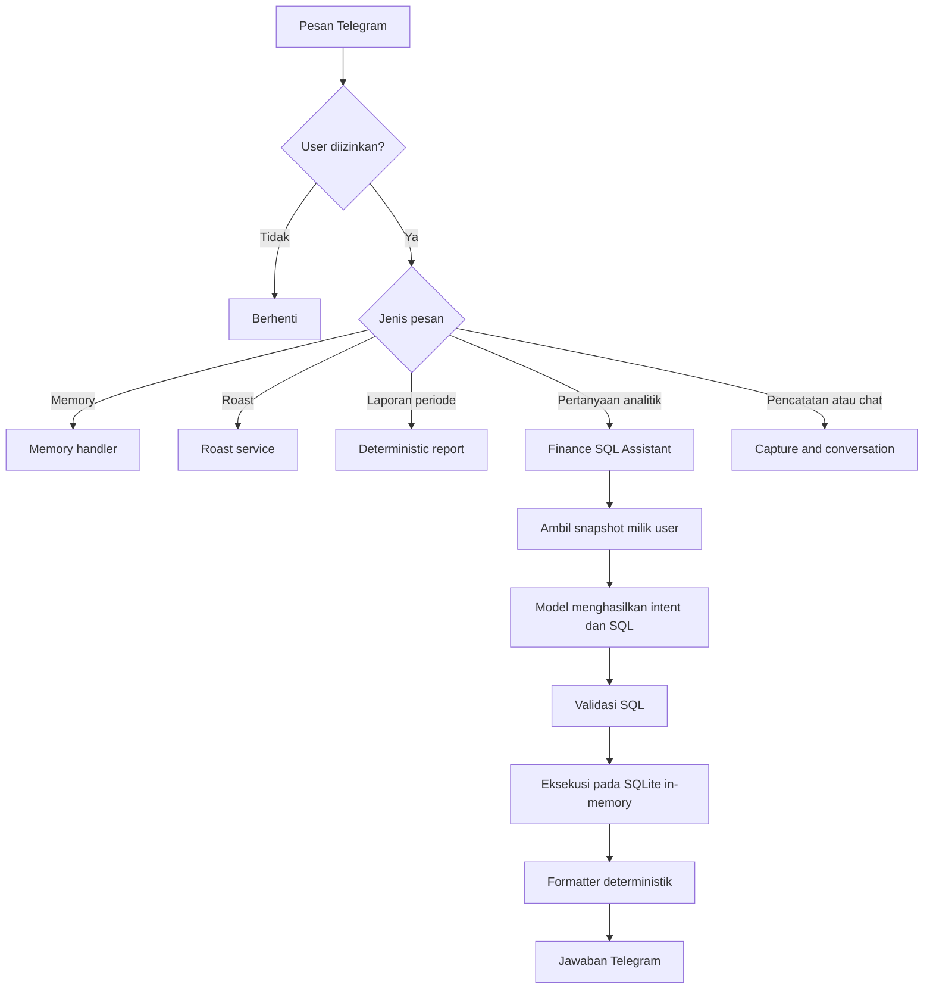
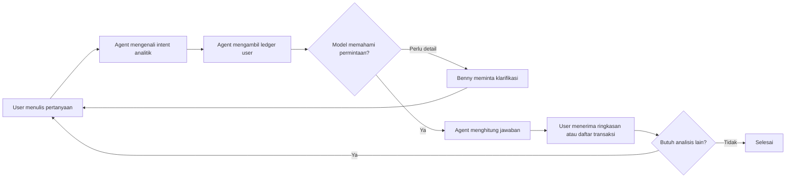
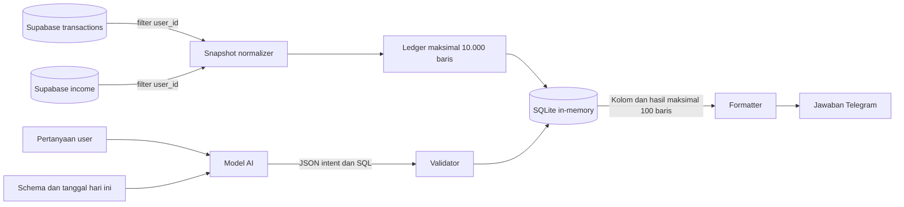
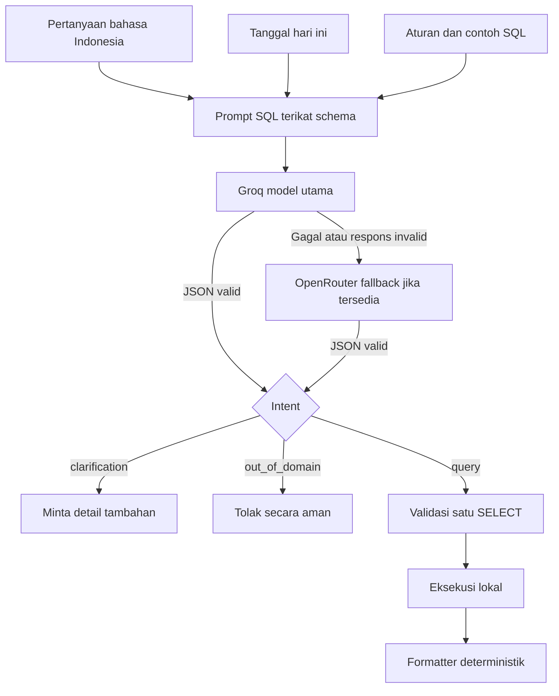

# Finance SQL Assistant

## Deskripsi

Finance SQL Assistant adalah fitur analitik read-only yang memungkinkan pengguna bertanya tentang pemasukan dan pengeluaran melalui Telegram menggunakan bahasa sehari-hari. Pengguna tidak perlu menulis SQL.

Alurnya terdiri dari dua proses yang berbeda:

1. Model AI menerjemahkan pertanyaan bahasa manusia menjadi satu query SQL `SELECT`.
2. Aplikasi menjalankan query pada snapshot SQLite sementara, lalu formatter deterministik menerjemahkan hasil query menjadi jawaban bahasa Indonesia.

Model tidak menerjemahkan hasil SQL menjadi jawaban akhir dan tidak menerima isi ledger. Model hanya menerima pertanyaan, tanggal hari ini, schema tabel virtual, aturan keamanan, dan contoh query. Pemisahan ini membuat perhitungan tetap berasal dari database, bukan angka yang dibuat oleh model.

## Fungsi dan batas fitur

Fitur ini mendukung analisis read-only:

- total dan jumlah transaksi;
- pemasukan versus pengeluaran;
- kategori atau item dengan pengeluaran terbesar;
- top-N transaksi;
- minimum, maksimum, dan rata-rata;
- pengelompokan berdasarkan kategori, tanggal, minggu, atau bulan;
- rentang waktu seperti hari ini, minggu ini, bulan ini, dan N hari terakhir.

Fungsi utamanya adalah:

- mengubah pertanyaan keuangan berbahasa natural menjadi SQL;
- mengambil snapshot ledger yang hanya dimiliki user aktif;
- menghitung agregasi dan pencarian detail secara lokal;
- mengubah hasil query menjadi jawaban Indonesia dengan format Rupiah;
- menolak permintaan tulis dan query yang berada di luar batas aman.

Fitur ini tidak melakukan perubahan data, eksplorasi schema, forecasting, rekomendasi pengeluaran, budget, goals, dashboard, PDF, atau general-purpose chat.

## Struktur implementasi

| File | Tanggung jawab |
| --- | --- |
| `services/telegram/bot.py` | Menempatkan SQL Assistant setelah laporan deterministik dan sebelum capture transaksi. |
| `services/reporting/service.py` | Menangani laporan pengeluaran dengan periode yang deterministik. |
| `services/reporting/sql_assistant.py` | Routing analitik, validasi SQL, eksekusi SQLite, dan formatter jawaban. |
| `services/ai/service.py` | Meminta Groq, lalu fallback OpenRouter bila tersedia, membuat JSON intent dan SQL read-only. |
| `services/infrastructure/database.py` | Mengambil snapshot `transactions` dan `income` berdasarkan `user_id`. |
| `tests/test_finance_sql_assistant.py` | Regression test untuk routing, SQL safety, isolasi user, agregasi, dan formatter. |

Secara logis, implementasinya terbagi menjadi lima lapisan:

| Lapisan | Komponen | Peran |
| --- | --- | --- |
| Antarmuka | Telegram | Menerima pertanyaan dan menampilkan hasil. |
| Routing | `TelegramService` dan `FinanceSqlAssistant.try_handle()` | Membedakan laporan, analitik, pencatatan, dan permintaan write. |
| Retrieval | `SupabaseService.get_finance_snapshot()` | Membaca data user dari `transactions` dan `income`. |
| AI | `AIService.generate_finance_sql()` | Menghasilkan intent dan satu query SQLite read-only. |
| Eksekusi dan presentasi | Validator, SQLite `:memory:`, dan formatter | Memvalidasi SQL, menghitung hasil, lalu menyusun jawaban. |

## Data contract snapshot

Data production dinormalisasi ke satu tabel virtual bernama `ledger`:

| Kolom | Sumber `transactions` | Sumber `income` | Keterangan |
| --- | --- | --- | --- |
| `kind` | `expense` | `income` | Jenis ledger. |
| `date` | `date` | `date` | Format ISO `YYYY-MM-DD`. |
| `time` | `time` | `time` | Waktu transaksi. |
| `name` | `item_name` | `source` | Nama barang atau sumber pemasukan. |
| `category` | `category` | `category` | Kategori ledger. |
| `amount` | `amount` | `amount` | Integer IDR positif. |
| `notes` | `notes` | `notes` | Catatan transaksi bila tersedia. |
| `location` | `location` | string kosong | Lokasi pengeluaran bila tersedia. |

`user_id`, chat history, memory, dan kolom internal tidak dimasukkan ke snapshot. Ownership sudah diterapkan sebelum data meninggalkan Supabase.

## Flowchart end-to-end



## User flow



Pengguna cukup menyebut objek analisis, metrik, dan periode bila diperlukan. Contoh: `total pengeluaran bulan ini`, `lima transaksi terbesar`, atau `kapan aku bayar ChatGPT`. Jika periode atau metrik benar-benar ambigu, agent meminta satu klarifikasi singkat dan tidak menebak.

## Data flow dan retrieval



Retrieval dilakukan oleh `SupabaseService.get_finance_snapshot(user_id)`:

1. Query `transactions` mengambil `date`, `time`, `item_name`, `category`, `amount`, `notes`, dan `location` dengan filter `user_id`.
2. Query `income` mengambil `date`, `time`, `source`, `category`, `amount`, dan `notes` dengan filter `user_id`.
3. Kedua hasil dinormalisasi menjadi kontrak `ledger` yang sama.
4. Baris digabung, diurutkan dari tanggal dan waktu terbaru, lalu dibatasi maksimal 10.000 baris.
5. Snapshot dimuat ke SQLite `:memory:` hanya selama request berjalan dan koneksi ditutup setelah query selesai.

Tidak ada pencarian semantik, embedding, atau vector database. Retrieval di sini adalah pembacaan terfilter berdasarkan ownership user, lalu analisis relasional menggunakan SQL.

## AI flow dan cara model bekerja



Model bekerja sebagai penerjemah intent dan query, bukan sebagai kalkulator keuangan:

1. Prompt mendefinisikan schema virtual `ledger`, tanggal hari ini, istilah informal Indonesia, batas query, dan contoh SQL.
2. Model utama memakai provider Groq dengan `temperature=0`. Jika request gagal atau respons tidak valid, aplikasi dapat mencoba model OpenRouter yang sudah dikonfigurasi.
3. Model wajib mengembalikan JSON berisi `intent`, `sql`, dan `clarification`.
4. Model memilih `query`, `clarification`, atau `out_of_domain`.
5. Untuk intent `query`, SQL tetap dianggap tidak tepercaya dan harus lolos validator serta SQLite authorizer.
6. SQLite menghitung hasil dari data nyata. Formatter aplikasi menentukan judul, label, Rupiah, detail transaksi, dan pemecahan pesan tanpa meminta model kedua.

Model tidak menerima raw ledger rows, `user_id`, chat history, memory, Supabase key, atau connection string. Karena itu model tidak dapat membaca database secara langsung atau membuat jawaban berdasarkan data yang tidak dikirim kepadanya.

## Workflow runtime

1. Telegram menerima pesan teks dari user yang diizinkan.
2. `TelegramService` memproses explicit-memory command terlebih dahulu.
3. `ExpenseReportService` mencoba laporan deterministik seperti `laporan kemarin` atau `total pengeluaran bulan ini`.
4. `FinanceSqlAssistant` memeriksa kata domain finansial dan kata analitik.
5. `SupabaseService.get_finance_snapshot()` membaca `transactions` dan `income` dengan filter `user_id`.
6. Snapshot dinormalisasi, digabung, diurutkan berdasarkan tanggal/waktu terbaru, lalu dibatasi maksimal 10.000 baris.
7. Model utama Groq menerima pertanyaan, tanggal hari ini, dan schema virtual `ledger`; fallback OpenRouter dapat dipakai bila tersedia. Provider tidak menerima Supabase key, connection string, atau raw rows.
8. Respons model harus berupa JSON dengan intent `query`, `clarification`, atau `out_of_domain`.
9. Query `SELECT` divalidasi, dijalankan pada SQLite `:memory:`, dan hasil dibatasi maksimal 100 baris.
10. Formatter memilih structured response type dari intent dan bentuk hasil. Renderer menampilkan jawaban utama lebih dulu tanpa mengulang pertanyaan atau proses SQL. Rincian transaksi menampilkan nama, nominal, waktu, serta note dan lokasi bila tersedia.
11. Hasil panjang dikirim dalam beberapa pesan agar tidak terpotong oleh batas Telegram.

## Use case

| No. | Kebutuhan | Contoh pertanyaan | Bentuk analisis |
| --- | --- | --- | --- |
| 1 | Mengukur kebiasaan transaksi | `Pengeluaran apa yang paling sering?` | Hitung frekuensi per nama serta total nominalnya. |
| 2 | Melihat transaksi terbesar | `5 transaksi paling besar apa saja?` | Daftar detail terurut dengan `LIMIT 5`. |
| 3 | Menemukan kategori paling boros | `Kategori paling boros apa?` | `GROUP BY category`, urut total terbesar. |
| 4 | Membandingkan arus uang | `Bandingkan total pemasukan dan pengeluaran` | Agregasi berdasarkan `kind`. |
| 5 | Menghitung rata-rata | `Rata-rata pengeluaran berapa?` | `AVG` untuk seluruh snapshot pengeluaran. |
| 6 | Mencari transaksi berdasarkan nominal | `Aku beli apa saja antara 10 sampai 60 ribu?` | Filter `amount BETWEEN` dan daftar detail. |
| 7 | Menemukan waktu pembayaran tertentu | `Kapan aku subscribe ChatGPT?` | Pencarian nama case-insensitive dan urutan terbaru. |
| 8 | Menghitung biaya item tertentu | `Total pengeluaran untuk ChatGPT berapa?` | Pencarian nama dan `SUM` nominal. |

## Cara menggunakan

Kirim pertanyaan natural language seperti:

```text
Pengeluaran apa yang paling sering?
Kategori paling boros apa?
Bandingkan total pemasukan dan pengeluaran.
5 transaksi paling besar apa saja?
Rata-rata pengeluaran berapa?
Kapan aku subscribe ChatGPT?
```

Contoh jawaban:

```text
Pengeluaran Terbesar

Kategori: Makanan
Total pengeluaran: Rp750.000
```

Kalimat pencatatan seperti `beli kopi 25 ribu` tetap masuk capture dan confirmation flow. Kalimat `hapus semua transaksi` ditolak sebagai permintaan write.

## SQL generation contract

Provider AI hanya boleh menghasilkan JSON berikut:

```json
{
  "intent": "query",
  "sql": "SELECT ... FROM ledger ...",
  "clarification": ""
}
```

Prompt SQL menetapkan tanggal hari ini sebagai literal agar periode tidak bergantung pada clock SQLite. Contoh query yang diharapkan:

```sql
SELECT category, SUM(amount) AS total_pengeluaran
FROM ledger
WHERE kind = 'expense'
  AND date BETWEEN '2026-08-01' AND '2026-08-14'
GROUP BY category
ORDER BY total_pengeluaran DESC
LIMIT 1
```

## Guardrail

### Boundary routing

- User harus lolos private-user check.
- Laporan deterministik diprioritaskan sebelum SQL Assistant.
- Pernyataan transaksi tidak boleh salah dianggap sebagai query analitik.
- Permintaan write finansial ditolak sebelum akses database.

### Boundary data

- Semua query Supabase memakai `user_id` user aktif.
- Snapshot tidak disimpan ke disk dan tidak dikirim ke model.
- Snapshot hanya memuat delapan kolom virtual yang diperlukan untuk analisis.
- Batas snapshot adalah 10.000 transaksi terbaru per request.

### Boundary SQL

- Tepat satu statement.
- Hanya `SELECT` atau `WITH ... SELECT`.
- Hanya tabel `ledger` dan CTE yang merujuk ke `ledger`.
- Dilarang `INSERT`, `UPDATE`, `DELETE`, `DROP`, `ALTER`, `CREATE`, `ATTACH`, `DETACH`, `PRAGMA`, dan statement mutasi lain.
- Query detail wajib memiliki `LIMIT` 1–100.
- Fungsi SQLite dibatasi allowlist.
- SQLite authorizer menolak operasi read/write di luar tabel virtual.
- Progress handler menghentikan query yang berjalan terlalu lama.

### Boundary output

- Maksimal 100 baris hasil.
- Jawaban dipotong pada batas Telegram sekitar 4.000 karakter.
- Nominal integer diformat sebagai Rupiah.
- Kategori umum diterjemahkan ke label Indonesia.
- Response type dipilih secara deterministik dari intent dan bentuk kolom hasil.
- Jawaban utama ditampilkan sebelum konteks dan detail.
- Pertanyaan user serta detail proses SQL tidak diulang pada respons normal.
- Output tidak memakai emotikon.
- Hasil kosong dibedakan dari kegagalan database, kegagalan provider, dan query tidak aman.

## Error behavior

| Kondisi | Respons user |
| --- | --- |
| Snapshot kosong | Tidak ada data transaksi yang dapat dianalisis. |
| Supabase gagal | Data keuangan belum dapat diambil dari database. |
| Pertanyaan ambigu | Benny meminta satu klarifikasi singkat. |
| Provider Groq gagal | Layanan analitik sementara tidak tersedia. |
| SQL tidak aman | Query analitik tidak aman atau tidak dapat dijalankan. |
| Permintaan di luar domain | Benny hanya menjawab analisis read-only keuangan pribadi. |

## Configuration and verification

Fitur memakai konfigurasi AI yang sudah ada:

- `GROQ_API_KEY`
- `GROQ_MODEL`
- `OPENROUTER_API_KEY` dan `OPENROUTER_MODEL` untuk fallback bila dikonfigurasi
- `AI_TIMEOUT_SECONDS`
- `AI_MAX_RETRIES`
- `SUPABASE_URL`
- `SUPABASE_SERVICE_ROLE_KEY` untuk backend server-only

Verifikasi lokal:

```powershell
.\venv\Scripts\python.exe -m unittest discover -s tests -p 'test_*.py'
.\venv\Scripts\python.exe -m compileall -q config services main.py tests
```

Smoke test production harus read-only: gunakan pertanyaan analitik, cek jawaban Telegram, dan pastikan jumlah baris `transactions` serta `income` tidak berubah.

## Known ceiling

Snapshot saat ini mengambil maksimal 10.000 transaksi terbaru. Jika ukuran data atau latency melewati batas, upgrade path adalah reporting view atau RPC read-only yang tetap ownership-scoped. Direct SQL ke database production bukan upgrade path default.
