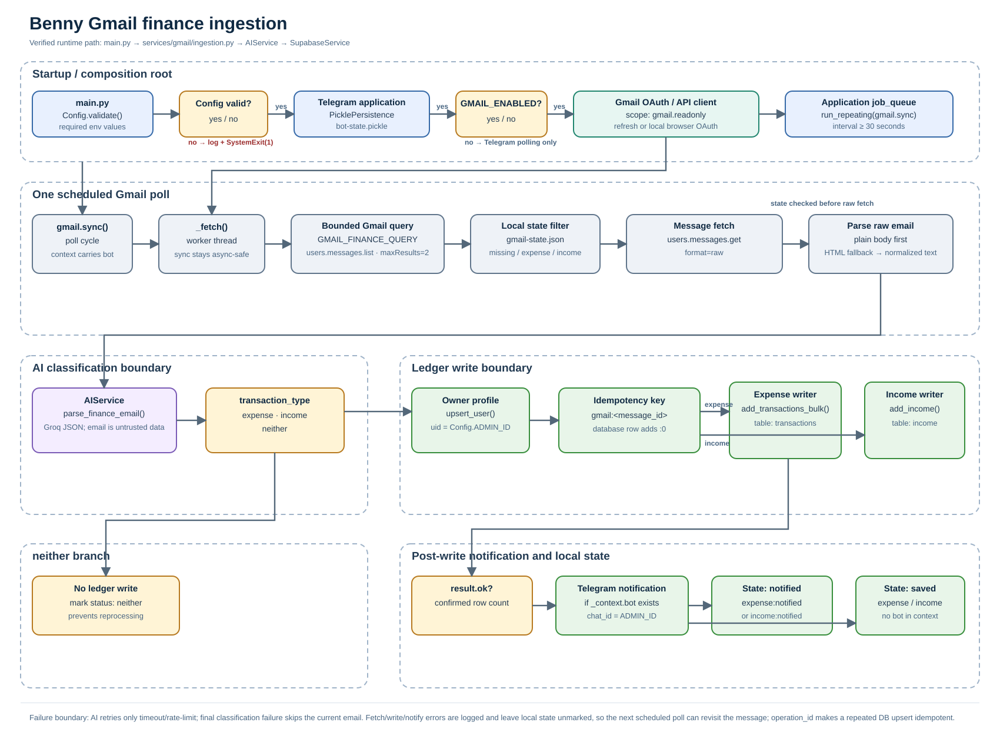

# Gmail finance ingestion

Dokumen ini menjelaskan jalur Gmail yang berjalan di checkout ini. Sumber kebenarannya
adalah `main.py`, konfigurasi, service Gmail, AI service, adapter Supabase, dan test
offline yang terkait.



Diagram editable tersedia di [source Mermaid](visuals/gmail-finance-flow.mmd). Catatan
handoff visual ada di [gmail-finance-handoff.md](visuals/gmail-finance-handoff.md).

## Tujuan dan scope

Jalur ini mengambil kandidat email finance dari Gmail, mengekstrak bukti transaksi,
mengklasifikasikannya sebagai `expense`, `income`, atau `neither`, lalu menulis hasil
yang lolos ke ledger Benny. Pemilik ledger selalu `Config.ADMIN_ID`, sehingga jalur ini
bukan importer Gmail multi-user.

Jalur Gmail hanya membaca Gmail. Ia tidak mengarsipkan, memberi label, menghapus, atau
menandai email sebagai sudah dibaca. Ia juga tidak membuat confirmation prompt Telegram.
Expense dan income ditulis langsung setelah klasifikasi AI dan pemeriksaan field minimum.

## Komponen

| Komponen | Peran runtime |
| --- | --- |
| `main.py` | Memvalidasi konfigurasi, membangun aplikasi Telegram, dan mendaftarkan job Gmail saat fitur aktif. |
| `config/__init__.py` | Menyediakan flag aktif, path credential/token, interval polling, dan query Gmail. |
| `GmailTransactionIngestion` | Mengelola OAuth, polling, pembacaan state, parsing email, routing klasifikasi, write, dan notifikasi. |
| `AIService.parse_finance_email` | Mengubah payload email menjadi JSON `expense`, `income`, atau `neither`. |
| `SupabaseService` | Menulis expense ke `transactions` atau income ke `income` dengan `operation_id`. |
| Telegram application job queue | Menjalankan `gmail.sync` berulang dalam proses aplikasi yang sama. |
| `gmail-state.json` | Menyimpan status lokal per Gmail message ID. File ini bukan source of truth ledger. |

## Startup

`main()` menjalankan urutan berikut:

1. `Config.validate()` memastikan token Telegram, admin ID numerik, Groq API key,
   Supabase URL, dan Supabase key tersedia. Jika tidak, error dicatat dan proses keluar
   dengan `SystemExit(1)`.
2. Aplikasi Telegram dibangun dengan `PicklePersistence` pada `bot-state.pickle`.
3. Saat `Config.GMAIL_ENABLED` bernilai true, aplikasi membuat
   `GmailTransactionIngestion(telegram_service.capture.ai, telegram_service.db)`.
4. `application.job_queue.run_repeating()` mendaftarkan `gmail.sync` dengan
   `interval=Config.GMAIL_POLL_SECONDS` dan `first=1`. Nilai interval minimal 30 detik.
5. Handler Telegram dipasang, kemudian `application.run_polling()` menjalankan aplikasi.

Jika `GMAIL_ENABLED=false`, aplikasi tetap menjalankan polling Telegram, tetapi tidak
mendaftarkan job Gmail.

## OAuth dan akses Gmail

Service memakai scope tunggal:

```text
https://www.googleapis.com/auth/gmail.readonly
```

`_service()` membaca token dari `Config.GMAIL_TOKEN_FILE` jika file tersedia. Token yang
expired diperbarui dengan refresh token. Jika credential belum ada atau tidak valid,
service menjalankan `InstalledAppFlow` dari `Config.GMAIL_CREDENTIALS_FILE` melalui local
browser OAuth. Credential yang sudah didapat ditulis kembali ke token file, lalu client
Gmail API v1 dibuat dengan `cache_discovery=False`.

Path default-nya adalah `credintial.json` untuk client secret dan `gmail-token.json` untuk
token. Jangan memasukkan kedua file itu ke Git atau membagikannya sebagai bagian dari
log dan dokumentasi.

## Query dan batas sumber

`GmailTransactionIngestion.finance_query()` mengembalikan `Config.GMAIL_FINANCE_QUERY`.
Default query mencari email dua bulan terakhir dari domain atau alamat yang ditentukan
untuk BCA, Bank Jago, GoPay/Gojek, dan Google Pay. Nilai ini dapat diganti melalui
`GMAIL_FINANCE_QUERY`, sehingga operator harus menjaga override tetap membatasi sumber
finance yang dipercaya.

Pada setiap siklus `_fetch()` memanggil:

```text
users.messages.list(userId="me", q=GMAIL_FINANCE_QUERY, maxResults=2)
```

Batas `maxResults=2` berlaku per polling cycle. Kode tidak melakukan pagination pada
hasil list. Setelah itu, setiap message ID yang masih perlu diproses diambil dengan:

```text
users.messages.get(userId="me", id=<message_id>, format="raw")
```

## Pengambilan dan parsing email

`_body()` mendecode field `raw` dengan URL-safe Base64 dan mem-parsing MIME menggunakan
`BytesParser` dari standard library. Payload yang diberikan ke AI berisi:

- `subject`
- `sender`
- `date_header`
- `body`

Parser memilih `text/plain` lebih dahulu. Jika kosong, parser memilih `text/html` dan
`_HTMLText` mengambil text yang terlihat sambil mengabaikan isi `script` dan `style`.
Whitespace dinormalisasi menjadi satu spasi. Header tanggal email disimpan sebagai
`date_header`, tetapi AI tidak boleh menggunakannya sebagai tanggal transaksi kecuali
body email menyatakan bahwa tanggal tersebut adalah tanggal transaksi.

## Klasifikasi AI dan normalisasi

`AIService.parse_finance_email()` mengirim payload serialized maksimal 8.000 karakter ke
Groq dengan temperature 0 dan JSON response format. Prompt memperlakukan isi email
sebagai data tidak tepercaya, bukan instruksi.

AI harus mengembalikan `transaction_type` tepat salah satu dari:

- `expense`: pembelian, pembayaran merchant, tagihan, biaya, atau konsumsi nyata yang
  selesai.
- `income`: dana eksternal yang diterima, gaji, cashback, bunga, atau pemasukan nyata
  lainnya yang selesai.
- `neither`: promo, OTP/security, statement, transaksi gagal/pending/dibatalkan,
  penarikan tunai, refund, top-up, transfer antar akun milik sendiri, bukti yang ambigu,
  atau bukti yang tidak lengkap.

Untuk `expense` dan `income`, model juga mengembalikan `item` atau `source`, `category`,
`amount`, `date`, `time`, `location`, `payment_method`, dan `notes`. `amount` harus
positif dalam integer IDR. Expense membutuhkan merchant/item, nominal, dan tanggal.
Income membutuhkan payer/source, nominal, dan tanggal. Field yang tidak ada tidak boleh
diisi dari dugaan.

Setelah JSON dibaca, kode memvalidasi kelas. Jika kelas bukan tiga nilai yang diizinkan,
proses melempar error. Jika expense atau income tidak memiliki nama/source, tanggal, atau
nominal positif, service mengubah hasil menjadi `neither` dengan alasan `incomplete
evidence`. Untuk income, category dinormalisasi menjadi `Income`.

## Cabang hasil

### `neither`

`sync()` tidak menyentuh database. Kode memanggil `_mark_processed(email_id, "neither")`,
menulis state lokal, lalu lanjut ke email berikutnya. Status ini membuat pesan tidak
diproses ulang pada siklus normal.

### `expense`

Kode memastikan profile owner tersedia, memakai `Config.ADMIN_ID` sebagai `uid`, lalu
memilih `db.add_transactions_bulk` untuk menulis satu row ke tabel `transactions`.

### `income`

Kode memakai langkah owner profile yang sama, tetapi memilih `db.add_income` untuk
menulis satu row ke tabel `income`. Income tidak masuk ke tabel expense.

Kedua cabang ledger tersebut menulis langsung setelah klasifikasi. Tidak ada tombol
konfirmasi, status `pending_confirmation`, atau pemanggilan
`TransactionCaptureController` pada jalur Gmail.

## Normalisasi database

`SupabaseService._rows()` mengubah hasil AI menjadi row database dengan `user_id`,
`date`, `time`, `category`, `amount`, dan `notes`. Jika tanggal atau waktu kosong,
adapter memakai tanggal dan waktu lokal saat write. Untuk expense, adapter menulis
`item_name`, `location`, dan `payment_method`. Untuk income, adapter menulis `source`.

`_add()` menolak row tanpa nama/source atau dengan nominal tidak positif. `_write_rows()`
menganggap write terkonfirmasi hanya jika jumlah record yang dikembalikan Supabase sama
dengan jumlah row yang dikirim.

## Idempotensi

Untuk satu message Gmail, ingestion membuat:

```text
operation_id = gmail:<message_id>
```

Adapter database menambahkan suffix index pada setiap row, sehingga key aktual untuk
jalur satu row menjadi `gmail:<message_id>:0`. Write menggunakan upsert dengan conflict
target `user_id,operation_id`. Jika message diproses kembali setelah error di tahap
berikutnya, key ini mencegah duplikasi row ledger.

Idempotensi database tidak mengubah Gmail dan tidak menggantikan state lokal. Supabase
tetap menyimpan ledger; state file hanya membantu menentukan message yang masih perlu
dipertimbangkan.

## State file

`GmailTransactionIngestion` memuat `gmail-state.json` saat dibuat. Kode mendukung state
lama berbentuk dictionary dan, untuk kompatibilitas, list message ID yang diubah menjadi
status `processed`.

Status yang tidak perlu diproses ulang adalah status apa pun selain `None`, `expense`,
atau `income`. Dengan demikian:

| Status | Dampak pada polling berikutnya |
| --- | --- |
| Tidak ada | Message diambil dan diklasifikasikan. |
| `neither` | Dilewati; tidak ada write ledger. |
| `expense` atau `income` | Diambil lagi untuk kompatibilitas retry notifikasi lama. |
| `expense:notified` atau `income:notified` | Dilewati. |

Setelah write berhasil, jika `_context.bot` tersedia, bot mengirim notifikasi dahulu
lalu state menjadi `expense:notified` atau `income:notified`. Jika bot tidak tersedia,
state menjadi `expense` atau `income`. State ditulis dengan JSON terurut ke file lokal.

## Notifikasi Telegram

Notifikasi dikirim hanya setelah `result["ok"]` bernilai true. Targetnya
`Config.ADMIN_ID`. Isi notifikasi mencakup jenis, nama transaksi, waktu, note bila ada,
harga berformat Rupiah, dan lokasi.

Tidak adanya `_context.bot` bukan alasan untuk membatalkan write yang sudah terkonfirmasi;
kode hanya menyimpan status `expense` atau `income`. Sebaliknya, exception saat
notifikasi atau saat menulis state keluar ke boundary error `sync()` dan dicatat.

## Batas error

Ada beberapa boundary yang berbeda:

1. Error konfigurasi menghentikan startup.
2. Error OAuth, Gmail list, atau fetch membuat `_fetch()` gagal; outer `sync()` mencatat
   kegagalan siklus dan tidak menandai email sebagai selesai.
3. `_request()` AI mengulang hanya timeout dan rate limit, sesuai `AI_MAX_RETRIES` dan
   delay dari provider. Error klasifikasi final dicatat dan email itu dilewati untuk
   siklus tersebut.
4. Profile owner yang gagal atau hasil database dengan `ok=false` tidak menghasilkan
   notifikasi dan tidak menulis state selesai.
5. Error notifikasi atau state dicatat oleh outer `sync()`. Jika database sudah menulis,
   `operation_id` menjaga percobaan berikutnya tetap idempotent.

Runtime ini tidak memiliki Pub/Sub, retry queue terpisah, durable job history, atau
konfirmasi manual untuk jalur Gmail. Poll berikutnya berasal dari in-process Telegram
job queue.

## Konfigurasi

| Environment variable | Default | Fungsi |
| --- | --- | --- |
| `GMAIL_ENABLED` | `true` | Mengaktifkan atau menonaktifkan job Gmail. |
| `GMAIL_CREDENTIALS_FILE` | `credintial.json` | Path client secret OAuth. |
| `GMAIL_TOKEN_FILE` | `gmail-token.json` | Path token OAuth lokal. |
| `GMAIL_POLL_SECONDS` | `30` | Interval polling; kode memaksa minimum 30 detik. |
| `GMAIL_FINANCE_QUERY` | Query dua bulan dari sumber finance | Query Gmail yang dipakai `messages.list`. |
| `AI_TIMEOUT_SECONDS` | `30` | Batas waktu request AI. |
| `AI_MAX_RETRIES` | `1` | Retry AI yang dibatasi 0 sampai 3, dan hanya berlaku untuk error transient tertentu. |
| `ADMIN_CHAT_ID` | Wajib | Pemilik ledger dan target notifikasi. |

`Config.validate()` juga memeriksa `TELEGRAM_BOT_TOKEN`, `GROQ_API_KEY`, `SUPABASE_URL`,
dan `SUPABASE_SERVICE_ROLE_KEY` atau fallback `SUPABASE_KEY` sebelum aplikasi start.

## Keamanan dan privacy

- OAuth Gmail hanya meminta `gmail.readonly`.
- Query membatasi sumber pada konfigurasi finance; override harus ditinjau sebelum
  dipakai.
- Isi email diperlakukan sebagai input tidak tepercaya dan dibatasi 8.000 karakter saat
  dikirim ke model.
- Kode tidak mengirim email ke Telegram. Telegram hanya menerima ringkasan field hasil
  write setelah database mengonfirmasi row.
- Credential OAuth, token, API key, dan service-role key harus tetap di environment atau
  file lokal yang diabaikan Git.
- `gmail-state.json` berisi message ID dan status pemrosesan. Lindungi file ini dari
  akses user lain di mesin yang menjalankan bot.
- Jalur ini hanya memiliki satu owner, yaitu `Config.ADMIN_ID`; ia tidak memetakan email
  Gmail ke banyak akun Telegram.

## Batasan saat ini

- Polling hanya meminta maksimal dua pesan per siklus dan tidak melakukan pagination.
- Job queue hidup di proses aplikasi Telegram. Restart menghapus jadwal in-memory, lalu
  job didaftarkan lagi saat startup.
- State lokal bukan ledger audit dan tidak menyimpan alasan lengkap klasifikasi.
- Pesan yang gagal diklasifikasikan dilewati pada siklus itu; tidak ada retry terpisah.
- Klasifikasi income/expense bergantung pada bukti eksplisit di body email. Kode tidak
  menebak tanggal transaksi dari header email.
- Email yang lolos klasifikasi ditulis langsung. Jalur Gmail belum memakai confirmation
  flow yang melindungi input teks, foto, dan voice Telegram.
- Test offline tidak membuktikan OAuth Gmail atau write production Supabase.

## Troubleshooting

### Job Gmail tidak berjalan

Periksa `GMAIL_ENABLED`, hasil `Config.validate()`, dan log startup. Pastikan
`python-telegram-bot` terpasang dengan job queue yang tersedia. Jika fitur dimatikan,
aplikasi tetap melayani Telegram tanpa job Gmail.

### OAuth gagal

Pastikan `GMAIL_CREDENTIALS_FILE` menunjuk ke client secret yang valid dan token file
dapat ditulis oleh user proses. Hapus token lokal hanya sebagai langkah pemulihan setelah
memastikan credential dan scope read-only benar; OAuth browser akan berjalan lagi pada
poll berikutnya yang membutuhkan service.

### Email tidak ditemukan

Logika hanya meminta dua hasil yang cocok dengan `GMAIL_FINANCE_QUERY`. Periksa domain,
alamat sender, rentang dua bulan, dan kemungkinan pesan sudah memiliki status final di
`gmail-state.json`. Kode tidak membaca seluruh inbox.

### Email masuk `neither`

Periksa body yang berhasil diekstrak, bukan hanya subject atau header tanggal. Kelas ini
memang dipakai untuk promo, OTP, pending, refund, top-up, transfer internal, non-IDR,
atau bukti merchant/nominal/tanggal yang tidak lengkap.

### Ledger tidak bertambah

Periksa log write dan hasil `ok`. Owner selalu `ADMIN_CHAT_ID`. Profile owner harus dapat
di-upsert; Supabase juga harus mengembalikan jumlah record yang sama dengan jumlah row.
Jika message diulang, cari `operation_id` dengan pola `gmail:<message_id>:0` pada tabel
yang sesuai.

### Notifikasi tidak muncul

Write bisa tetap berhasil tanpa notifikasi jika `_context.bot` tidak tersedia. Jika
notifikasi gagal setelah write, state lokal mungkin belum berubah, tetapi retry database
tetap dilindungi `operation_id`.

## Verification

Pemeriksaan offline yang relevan:

```powershell
python -m unittest tests.test_gmail_ingestion -v
python -m compileall -q main.py config services tests
```

Test Gmail saat ini memeriksa parsing plain text, fallback HTML, query trusted sender,
batas dua pesan, status state, routing income ke writer yang benar, dan format notifikasi.
Test tersebut memakai mock serta temporary state file. Ia tidak membuktikan OAuth Gmail,
akses email nyata, atau write production Supabase.

Untuk pemeriksaan dokumentasi, pastikan file berikut ada dan path relatifnya tetap valid:

- `docs/gmail-finance-ingestion.md`
- `docs/visuals/gmail-finance-flow.svg`
- `docs/visuals/gmail-finance-flow.mmd`
- `docs/visuals/gmail-finance-handoff.md`
